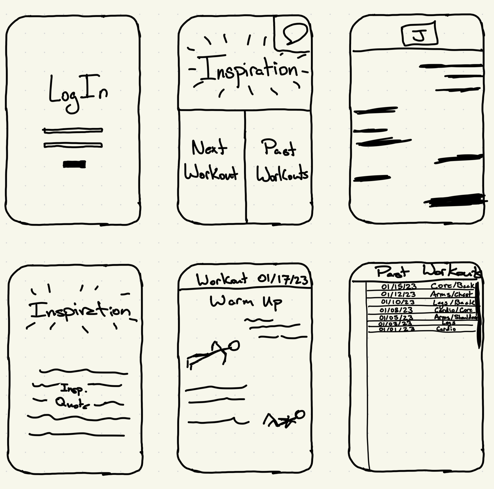

# **HealthCheck**
### Elevator Pitch
Are your clothes fitting tight? Do you sigh at the mirror when you catch yourself at the wrong angle? Do you feel more like Jabba the Hutt than Luke Skywalker? Is it time to make a change, but you don't know where to start? Look no futher! HealthCheck is a companion for you to begin your journey towards the physique you've always wanted. After a quick consultation you are paired with a personal trainer who will tailor your workouts to you and your goals. With HealthCheck's instructional focus and direct communication with your trainer, you'll never feel lost or confused about what to do next. Be healthy, be happy. HealthCheck.

### Key Features
- An account for each user with login credentials
- A central home screen to connect to any other section of the app
- An *Inspiration* page that shows an inspirational quote to motivate the user
- A *Next Workout* tab that is a direct link to the next planned workout.
- A *Past Workouts* page that can be used to reference any past workouts that have been facilitated through the app
- A DM screen to communicate with your personal trainer.

### Technologies
- **HTML, CSS, Javascript** - These three will be used for the early stages of setting up the page. HTML for the skeleton and content, CSS for some of the design and making the app look nice, and Javascript for interactivity.
- **Web Service** - This technology will be used to find the inspirational quotes for the user.
- **Authentication** - Authentication will be used for the user accounts.
- **Database Persistence** - This technology will be used to store the user's workout history which can be used for refence in the *Past Workouts* page.
- **Web Socket** - Web Socket technology will be used for the Direct Messages with the personal trainer and the workout of the day that he submits for the user.
- **Web Framework** I'm not sure what this will do but surely it will be awesome