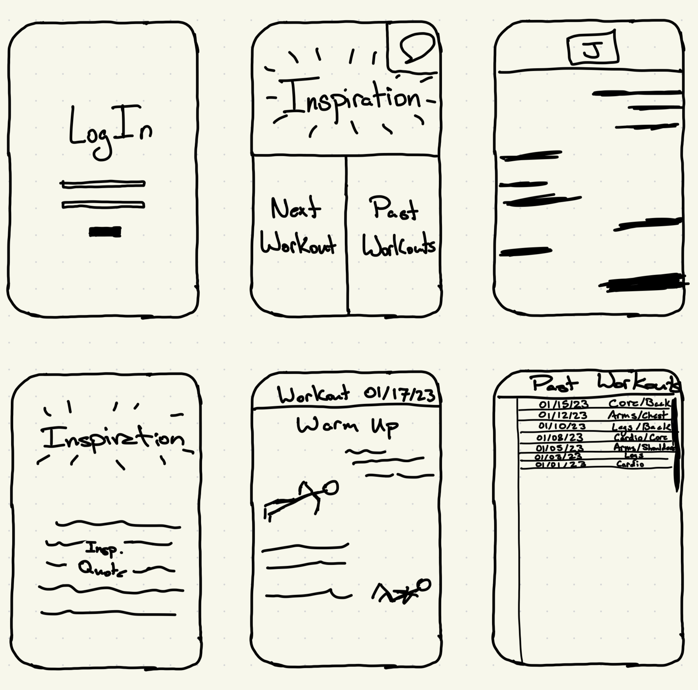

# **HealthCheck**
### Elevator Pitch
Are your clothes fitting tight? Do you sigh at the mirror when you catch yourself at the wrong angle? Do you feel more like Jabba the Hutt than Luke Skywalker? Is it time to make a change, but you don't know where to start? Look no futher! HealthCheck is a companion for you to begin your journey towards the physique you've always wanted. After a quick consultation you are paired with a personal trainer who will tailor your workouts to you and your goals. With HealthCheck's instructional focus and direct communication with your trainer, you'll never feel lost or confused about what to do next. Be healthy, be happy. HealthCheck.

### Key Features
- An account for each user with login credentials
- A central home screen to connect to any other section of the app
- An *Inspiration* page that shows an inspirational quote to motivate the user
- A *Next Workout* tab that is a direct link to the next planned workout.
- A *Past Workouts* page that can be used to reference any past workouts that have been facilitated through the app
- A DM screen to communicate with your personal trainer.

### Technologies
- **HTML, CSS, Javascript** - These three will be used for the early stages of setting up the page. HTML for the skeleton and content, CSS for some of the design and making the app look nice, and Javascript for interactivity.
- **Web Service** - This technology will be used to find the inspirational quotes for the user.
- **Authentication** - Authentication will be used for the user accounts.
- **Database Persistence** - This technology will be used to store the user's workout history which can be used for refence in the *Past Workouts* page.
- **Web Socket** - Web Socket technology will be used for the Direct Messages with the personal trainer and the workout of the day that he submits for the user.
- **Web Framework** I'm not sure what this will do but surely it will be awesome

## HTML Deliverable
For the HTML Deliverable I put together most of the structure for the different pages of the project. 

- **HTML pages** - Five HTML files that include a login screen, a direct message screen, a home page, an inspirational quote screen and a screen to look at past workouts.

- **Websocket Stand-in** - The visiualization of a conversation with your personal trainer on the direct message page represents the realtime chat that will be implemented with websocket

- **Inter-connectivity** - The Login screen is the index.html file, so it will be loaded first. After passing through the login screen you are taken to the home page. The home page can connect you to any of the other pages except for the login screen. The DM button is going to be a small speech bubble icon in one of the top left corners, and there is a link to the DM screen on every page that represents the speech bubble icon. Every page except for the home page and login page have a link to get back to the home page.

- **Pseudo-Authentification** - The Input box and login button currently work to get you into the next page. The info submitted here will later be used for authentification.

- **Database** - The Past Workouts page is currently fake list of workouts. This list will later be pulled and accessed from the database.

- **Web Service** - Web service calls will be done by the inspiration tab, which is currently displaying an inspirational quote stored in my repo as a placeholder.

## CSS Deliverable
During this section of the project I worked hard to make my website look like my initial sketches. 
- Flex was my best friend, it helped me organize my content very efficiently
- Windows are resizeable and do not get disproportionately large or small when the screen is resized.
- DM Box and Home page buttons (back buttons) are all uniform across all pages they are used on. 
- I used bootstrap framework for my login button, which looks more like the sketches.
- All content that needs to be centered is now centered and looks more organized and put-together than with only HTML.

## Javascript Deliverable
I used Javascript to start to incorporate a few new features.
-I incorporated a chat interface where you can send messages that are displayed on the screen. The page will then wait a second and send a fixed response from the person you are chatting with. 
-The login box on the index.html page is now used to save the user's name in the local storage, which is then used to greet the user on the home page and also used for verification on the DM page. 
-The past workouts screen is now creating an array of workout paths and stores the array as a JSON object in the local storage. These workouts are then brought back from the local database and the paths are taken back out of the array to create links to each of the past workouts. Currently all of the links point to the same place but the real database will hold the history of the workouts sent by the trainer. 

## Service Deliverable
Node JS and Express setup, and Inspirational quote page is running.
- All files are moved into public file and the system is now set up with an index.js file to run the website. 
- API call is made to get a random inspirational quote for the user to get motivated for their workout!

